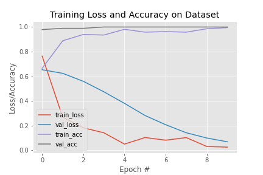

# covid-safety-detection with SafetyNet Model
This is custom model for detecting person with uncoverd face in midst of covid-19.
This code is inspired by **Adrian Rosebrock** founder of [@pyimagesearch](https://www.pyimagesearch.com/).

## Demo Video

## Results
__Training accuracy:__ 0.999  
__Validation accuracy:__ 0.998

